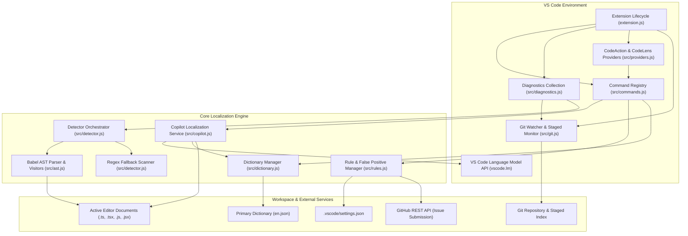
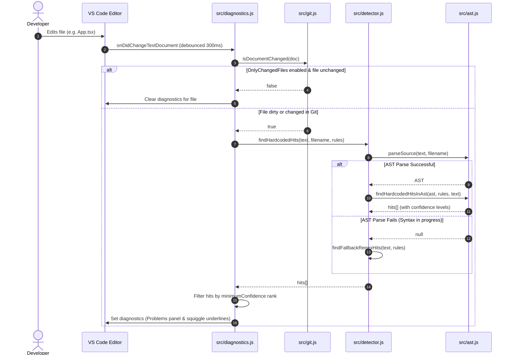
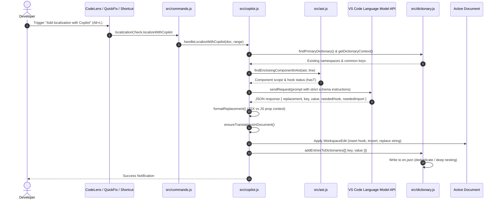

# Comprehensive Project Documentation: Localization Check Extension

## 1. Project Overview & Mission

**Localization Check** (`localization-check`) is a production-grade Visual Studio Code extension built in JavaScript (Node.js) that flags hardcoded, unlocalized, user-facing text strings in JavaScript and TypeScript codebases (`.js`, `.jsx`, `.ts`, `.tsx`).

### Core Purpose & Value Proposition
- **Automated Quality Gate**: Prevents developers from accidentally committing hardcoded UI strings that bypass internationalization (i18n).
- **Non-Intrusive & Git-Aware**: Automatically limits live diagnostic checks to Git-modified files, staged commits, and unsaved editor buffers to keep large repositories fast and clutter-free.
- **AST-Powered Precision**: Employs `@babel/parser` and `@babel/traverse` with full JSX/TSX/TypeScript support to inspect AST nodes with high syntactic awareness rather than relying solely on naive regex.
- **Fault-Tolerant Parsing**: Recovers gracefully from syntax errors during in-progress user typing, falling back seamlessly to an intelligent regex scanner.
- **GitHub Copilot Integration**: Seamlessly interfaces with VS Code's Language Model API (`vscode.lm`) to localize single strings or entire files in a single batch operation, automatically updating primary translation dictionaries (`en.json`) and inserting missing i18n hooks and imports.
- **Interactive Rule Learning & Community Feedback**: Allows developers to flag new attributes/tags/properties or report false positives with a single click, immediately updating workspace settings and optionally submitting structured reports to GitHub issues.

---

## 2. System Architecture & Component Diagram

### System Architecture Diagram



---

## 3. Detailed Workflow Sequences

### 3.1 Live Diagnostic Scanning Workflow



### 3.2 Single & Batch Copilot Localization Workflow



---

## 4. File-by-File Module Directory & Responsibilities

| File Path | Role & Key Responsibilities |
| :--- | :--- |
| [`extension.js`](file:///d:/Pramuditha/Dev%20projects/localization-check-extension/extension.js) | Extension entry point. Registers commands, CodeAction and CodeLens providers, diagnostic collections, configuration listeners, document change debouncers (300ms), and Git watchers. |
| [`src/constants.js`](file:///d:/Pramuditha/Dev%20projects/localization-check-extension/src/constants.js) | Defines shared constants: supported language IDs, default UI attribute names, default object property names, default JSX tags, configuration section keys, and default GitHub repository. |
| [`src/ast.js`](file:///d:/Pramuditha/Dev%20projects/localization-check-extension/src/ast.js) | Core Babel AST analysis engine. Configures Babel parser with extensive plugins and error recovery; performs AST traversal for JSX attributes, JSX text, object properties, variable declarations, notification functions, ternaries, template literals, and binary string concatenation; determines React component/schema scopes; inspects cursor code context. |
| [`src/detector.js`](file:///d:/Pramuditha/Dev%20projects/localization-check-extension/src/detector.js) | Bridge between VS Code configuration rules and AST parser. Loads user custom rules/ignored lists, invokes AST parsing, and provides fallback regex scanner when code contains in-progress syntax errors. |
| [`src/diagnostics.js`](file:///d:/Pramuditha/Dev%20projects/localization-check-extension/src/diagnostics.js) | Manages `vscode.DiagnosticCollection`. Evaluates confidence ranking (`low`, `medium`, `high`) against user settings; gates execution on Git change state; publishes diagnostics with accurate line/column ranges. |
| [`src/copilot.js`](file:///d:/Pramuditha/Dev%20projects/localization-check-extension/src/copilot.js) | Direct GitHub Copilot integration via `vscode.lm`. Constructs context-aware prompts with dictionary namespaces; parses and sanitizes model JSON responses; handles React component vs static schema rules; calculates accurate import and hook insertion lines; executes single and batch workspace edits with user preview dialogs. |
| [`src/dictionary.js`](file:///d:/Pramuditha/Dev%20projects/localization-check-extension/src/dictionary.js) | Translation dictionary management. Auto-discovers or creates `en.json`; parses nested and flat key structures; appends generated keys with deep property resolution; provides unused translation key analysis across all workspace files. |
| [`src/git.js`](file:///d:/Pramuditha/Dev%20projects/localization-check-extension/src/git.js) | VS Code Git extension integration (`vscode.git`). Checks working tree, index, untracked, and merge changes; monitors editor session dirty states; executes background check script on staged changes with non-blocking warning notifications. |
| [`src/providers.js`](file:///d:/Pramuditha/Dev%20projects/localization-check-extension/src/providers.js) | Implements `vscode.CodeActionProvider` (Quick Fixes for single string localization, batch localization, rule flagging, and false positive ignoring) and `vscode.CodeLensProvider` (displays clickable `$(sparkle) Add localization with Copilot` buttons). |
| [`src/rules.js`](file:///d:/Pramuditha/Dev%20projects/localization-check-extension/src/rules.js) | Interactive rule learning and reporting. Inspects AST context at cursor; appends custom tags, attributes, properties, or ignored words to `.vscode/settings.json`; triggers immediate re-scans; submits issues to GitHub via authenticated REST API or prefilled browser URLs. |
| [`src/commands.js`](file:///d:/Pramuditha/Dev%20projects/localization-check-extension/src/commands.js) | Command handlers and dispatcher. Normalizes document and range arguments from various triggers (command palette, shortcuts, context menus, CodeLens, CodeActions); executes external check script CLI. |
| [`scripts/check-version.js`](file:///d:/Pramuditha/Dev%20projects/localization-check-extension/scripts/check-version.js) | Build/CI script verifying version consistency between `package.json` and `README.md`. |
| [`test/suite/detector.test.js`](file:///d:/Pramuditha/Dev%20projects/localization-check-extension/test/suite/detector.test.js) | Comprehensive Mocha test suite covering 21 critical detection scenarios, confidence scoring, scope analysis, and technical exclusion edge cases. |

---

## 5. Detection Engine: Rules, Patterns & AST Mechanics

### 5.1 Detected Patterns & Confidence Scoring

The extension classifies all detected string candidates into three confidence tiers (`high`, `medium`, `low`). By default, `localizationCheck.minimumConfidence` is set to `"high"`.

| Pattern Type | AST Node Checked | Examples Detected | Confidence |
| :--- | :--- | :--- | :--- |
| **JSX Text** | `JSXText`, `JSXExpressionContainer` | `<button>Submit Form</button>`, `<div>{"Save Changes"}</div>` | **High** |
| **UI JSX Attributes** | `JSXAttribute` | `label="Name"`, `title="Close"`, `placeholder="Search..."`, `alt="..."`, `tooltip="..."` | **High** |
| **UI Object Properties** | `ObjectProperty` | `{ title: "Overview", label: "User", text: "Proceed", message: "Success" }` | **High** |
| **UI Variables & State** | `VariableDeclarator` | `const pageTitle = "Dashboard"`, `const [errorMsg, setError] = useState("Failed")` | **High** |
| **Notification Calls** | `CallExpression` | `showNotification("error", "Network timeout")`, `toast.error("Invalid input")`, `alert("Confirm delete")` | **High** (skips 1st severity param) |
| **Template Literals** | `TemplateLiteral` | `` `Welcome back, ${user.name}!` ``, `` `Showing ${start} to ${end} records` `` | **High** |
| **String Concatenations** | `BinaryExpression` (`+`) | `"Hello " + userName`, `"Account " + id + " is active"` | **High** |
| **Conditional Branches** | `ConditionalExpression` (`? :`) | `isLoggedIn ? "Log Out" : "Log In"` | **High** (in JSX) / **Low** (in JS) |
| **Logical Expressions** | `LogicalExpression` (`&&`, `\|\|`) | `hasError && "Could not save details"`, `status \|\| "Unknown"` | **High** (in JSX) / **Low** (in JS) |
| **Custom Words** | `StringLiteral` | Explicitly configured words in `customWords` | **High** |

### 5.2 Ignored & Technical Patterns (Zero False Positives)

To prevent cluttering diagnostics with non-UI technical strings, `src/ast.js` implements comprehensive filters:

1. **Programming & Language Types**:
   - TypeScript/JS types and globals: `Promise`, `Observable`, `AxiosResponse`, `Array`, `Record`, `Set`, `Map`, `Error`, `ReactNode`, `HTMLElement`, `any`, `unknown`, `never`, etc.
2. **Notification Status Words**:
   - Skips initial argument keywords: `error`, `success`, `info`, `warning`, `warn`, `loading`, `danger`, `alert`, `critical`, etc.
3. **CSS Color Names & Formats**:
   - Standard colors: `red`, `blue`, `green`, `transparent`, `inherit`, `currentcolor`, `geekblue`, `volcano`, etc.
   - Color functions: `rgb(...)`, `rgba(...)`, `hsl(...)`, `hsla(...)`, `#ffffff`.
   - CSS variables: `var(--primary-color)`.
4. **Technical & Routing Patterns**:
   - Absolute URLs: `https://...`, `http://...`.
   - Route paths: `/api/v1/...`, `/dashboard/${id}`, `./relative/path`.
   - Pure punctuation or symbols: `[{}$()[\]\\/_.:0-9%+-]+`.
5. **Technical Object & Attribute Contexts**:
   - Technical JSX attributes: `className`, `style`, `id`, `key`, `data-testid`, `testId`, `path`, `href`, `src`, `route`, `target`, `width`, `height`, `viewBox`, etc.
   - Technical object blocks: Properties inside `spec`, `apiSpec`, `lookupSpec`, `fieldMapping`, `extraFieldMappings` (e.g. `label: "batchTypeName"`).
   - Ignored HTML elements: All text inside `<code>`, `<pre>`, `<script>`, `<style>`.
6. **Code Naming Conventions**:
   - `camelCase` identifiers without spaces: `userAccountId`, `batchTypeCode`.
   - `snake_case` identifiers: `created_at`, `user_role_id`.
   - `kebab-case` identifiers: `user-card-header`.
   - Dotted paths: `user.profile.settings`.

---

## 6. Commands, Menus & Keybindings Reference

All extension commands feature default keybindings across Windows/Linux and macOS, along with context menu registrations.

| Command Title | Command ID | Windows / Linux | macOS | When Context / Where Visible |
| :--- | :--- | :--- | :--- | :--- |
| **Add Localization with Copilot** | `localizationCheck.localizeWithCopilot` | `Alt + L` | `⌥ + L` (`Cmd + Alt + L`) | Editor text focus, Quick Fix, CodeLens button |
| **Localize All in Current File** | `localizationCheck.localizeAllInFile` | `Alt + Shift + L` | `⌥ + ⇧ + L` (`Cmd + Alt + Shift + L`) | Editor text focus, Editor title bar icon, Quick Fix |
| **Find Unused Translation Keys** | `localizationCheck.findUnusedKeys` | `Alt + U` | `⌥ + U` (`Cmd + Alt + U`) | Command Palette, Global keybinding |
| **Flag Pattern as Hardcoded Rule** | `localizationCheck.flagHardcoded` | `Alt + F` | `⌥ + F` (`Cmd + Alt + F`) | Editor text focus, Context menu, Quick Fix |
| **Mark / Ignore as False Positive** | `localizationCheck.markFalsePositive` | `Alt + M` | `⌥ + M` (`Cmd + Alt + M`) | Editor text focus, Context menu, Quick Fix |
| **Re-scan Current File** | `localizationCheck.scanFile` | `Alt + S` | `⌥ + S` (`Cmd + Alt + S`) | Editor text focus, Command Palette |
| **Run Full Check (git staged)** | `localizationCheck.run` | `Alt + R` | `⌥ + R` (`Cmd + Alt + R`) | Command Palette, Global keybinding |

---

## 7. Configuration Settings Reference

Settings can be specified in `.vscode/settings.json` (workspace level) or global user settings.

```json
{
  "localizationCheck.scriptPath": "scripts/check-localization.js",
  "localizationCheck.liveScan": true,
  "localizationCheck.diagnosticSeverity": "error",
  "localizationCheck.minimumConfidence": "high",
  "localizationCheck.liveScanOnlyChangedFiles": true,
  "localizationCheck.warnOnStage": true,
  "localizationCheck.enableCodeLens": true,
  "localizationCheck.copilotPromptHint": "",
  "localizationCheck.dictionaryPath": "",
  "localizationCheck.autoUpdateDictionary": true,
  "localizationCheck.autoImportTranslation": true,
  "localizationCheck.customAttributes": ["caption", "headerTitle"],
  "localizationCheck.customProperties": ["subTitle", "bannerText"],
  "localizationCheck.customWords": ["Save Changes", "Discard"],
  "localizationCheck.customTags": ["Typography", "Badge"],
  "localizationCheck.ignoredWords": ["primary-dark", "UUID"],
  "localizationCheck.ignoredAttributes": ["data-testid"],
  "localizationCheck.ignoredProperties": ["id", "key"],
  "localizationCheck.ignoredTags": ["code", "pre", "script", "style"],
  "localizationCheck.githubRepo": "PramudithaN/localization-check"
}
```

### Detailed Settings Catalog

| Setting Name | Type | Default | Description |
| :--- | :--- | :--- | :--- |
| `localizationCheck.scriptPath` | `string` | `"scripts/check-localization.js"` | Path to the workspace's standalone localization CLI script. |
| `localizationCheck.liveScan` | `boolean` | `true` | Enables or disables live background scanning and squiggly underlines. |
| `localizationCheck.diagnosticSeverity` | `string` | `"error"` | Severity level displayed in the Problems panel: `"error"` or `"warning"`. |
| `localizationCheck.minimumConfidence` | `string` | `"high"` | Minimum confidence threshold required to flag strings: `"high"`, `"medium"`, or `"low"`. |
| `localizationCheck.liveScanOnlyChangedFiles` | `boolean` | `true` | Restricts scanning to Git-changed files and unsaved editor buffers. |
| `localizationCheck.warnOnStage` | `boolean` | `true` | Displays a warning notification when staged files contain hardcoded strings. |
| `localizationCheck.enableCodeLens` | `boolean` | `true` | Displays interactive CodeLens buttons directly above lines with unlocalized text. |
| `localizationCheck.copilotPromptHint` | `string` | `""` | Custom instructions passed to Copilot (e.g. `"Use react-intl formatMessage"`). |
| `localizationCheck.dictionaryPath` | `string` | `""` | Explicit path to `en.json`. When empty, automatically searches common locations. |
| `localizationCheck.autoUpdateDictionary` | `boolean` | `true` | Automatically writes generated translation keys and English values into `en.json`. |
| `localizationCheck.autoImportTranslation` | `boolean` | `true` | Automatically injects `import { useTranslation } from 'react-i18next'` and `const { t } = useTranslation()`. |
| `localizationCheck.customAttributes` | `array` | `[]` | Additional JSX/HTML attribute names to flag. |
| `localizationCheck.customProperties` | `array` | `[]` | Additional object property names to flag. |
| `localizationCheck.customWords` | `array` | `[]` | Exact words/phrases to explicitly flag across all files. |
| `localizationCheck.customTags` | `array` | `[]` | Additional JSX/HTML tag names whose inner text should be flagged. |
| `localizationCheck.ignoredWords` | `array` | `[]` | Exact words, literals, or template strings to never flag. |
| `localizationCheck.ignoredAttributes` | `array` | `[]` | Attribute names to completely ignore. |
| `localizationCheck.ignoredProperties` | `array` | `[]` | Object property names to completely ignore. |
| `localizationCheck.ignoredTags` | `array` | `["code", "pre", "script", "style"]` | Component/HTML tag names whose child text is ignored. |
| `localizationCheck.githubRepo` | `string` | `"PramudithaN/localization-check"` | GitHub repository (`owner/repo`) where rule suggestions and false positives are reported. |

---

## 8. GitHub Copilot Integration & Translation Automation

### 8.1 Intelligent Prompting & Architecture Awareness
When invoking Copilot (`Alt + L` or `Alt + Shift + L`), `src/copilot.js` performs deep architectural analysis:
1. **Existing Dictionary Namespaces**: Reads `en.json` and feeds existing top-level namespaces to Copilot so keys fit existing project conventions.
2. **Common Key Deduplication**: Extracts existing keys under the `common.` namespace (e.g. `common.save`, `common.cancel`, `common.submit`, `common.edit`) so Copilot reuses common keys instead of creating redundant entries.
3. **React Components vs Static Schemas**:
   - **Inside React Components**: Injects `const { t } = useTranslation()` and generates `t('namespace.key')`.
   - **Outside React Components (Static Schemas / Config Objects)**: Prohibits React hooks and prevents replacing labels with raw technical keys (`reports.branch`) that would leak unrendered key strings to end users.
4. **Syntax Formatting**:
   - In JSX children: formats as `{t('key')}`.
   - In JSX attributes: formats as `t('key')`.
   - In JS object properties: formats as `t('key')` without outer JSX brackets.

### 8.2 Reverse-Order Batch Workspace Edits
For file-wide batch localization (`Alt + Shift + L`):
- All detections are transmitted to Copilot in a single JSON-structured prompt.
- Proposed replacements are displayed in a modal confirmation preview dialog.
- Modifications are sorted in descending order (bottom to top) before executing `vscode.workspace.applyEdit(edit)` to guarantee that line and column offsets never drift during multi-line replacements.

### 8.3 Dictionary Synchronization (`en.json`)
- Deep JSON object path builder (`setDeepProperty`) writes dotted keys (`users.profile.editButton`) into nested object structures or flat formats based on existing dictionary conventions.
- Only the primary dictionary (`en.json`) is modified; other locales are left to localization pipelines.

---

## 9. Testing & Quality Assurance Suite

The repository contains an automated Mocha test suite in [`test/suite/detector.test.js`](file:///d:/Pramuditha/Dev%20projects/localization-check-extension/test/suite/detector.test.js) executed via:

```bash
npm test
```

### Test Coverage Highlights (21 Passing Tests):
- **JSX Attributes**: Correctly detects unlocalized `label`, `title`, `placeholder`, `aria-label`, `alt` while ignoring `className`, `id`, `data-testid`, `type`.
- **JSX Text**: Flags user-visible text in headings, paragraphs, and buttons while ignoring `<code>`, `<pre>`, `<script>`, `<style>`.
- **Object Properties**: Flags single-line and multiline UI properties while skipping `id`, `key`, `status`, `type`.
- **Notification Calls**: Ignores the first status argument (`"error"`, `"success"`, `"info"`) and flags message arguments.
- **Ternaries & Conditionals**: Flags conditional branches with low confidence; ignores comparison operands and color strings.
- **Template Literals**: Flags static text while ignoring URLs (`https://`), CSS variables (`var(--...)`), and CSS classes (`btn-...`).
- **Binary Concatenations**: Detects string operand concatenations while ignoring API route prefixes.
- **Identifiers & Colors**: Verifies zero false positives against 50+ programming types and color names.
- **Enclosing Component Detection**: Accurately locates component headers, body boundaries, and hook scopes.
- **Incomplete Code Resilience**: Ensures parser error recovery handles unclosed strings and syntax errors without crashing.
- **Technical Specs & Mappings**: Verifies that properties inside `spec: { label: "batchTypeName", value: "id" }` are never flagged.

---

## 10. Development, Build & Packaging Guide

### Prerequisites
- Node.js >= 18.x
- VS Code >= 1.84.0
- Visual Studio Code Extension Manager (`@vscode/vsce`)

### Installation & Local Debugging
1. Clone the repository and install dependencies:
   ```bash
   npm install
   ```
2. Open the project in VS Code:
   ```bash
   code .
   ```
3. Press `F5` to open an **Extension Development Host** window.
4. Open any project with `.tsx`, `.ts`, `.jsx`, or `.js` files to test live detection, CodeLens buttons, and Copilot quick fixes.

### Running Tests & Version Verification
```bash
# Run unit test suite
npm test

# Verify README and package.json version sync
npm run check:version
```

### Packaging & Distributing VSIX
```bash
# Install VS Code packaging tool globally
npm install -g @vscode/vsce

# Package extension into .vsix archive
vsce package

# Install generated package into VS Code
code --install-extension localization-check-0.5.9.vsix
```

---

## 11. Security, Concurrency & Path Safety Standards

1. **CWE-78 Command Injection Elimination**:
   - All external processes (such as running the localization check script) use `child_process.execFile` with parameterized argument arrays (`execFile("node", [scriptPath], ...)`), preventing shell command injection.
2. **Cross-Platform Path Normalization**:
   - File paths are normalized via `node:path` (`path.normalize`, `path.join`) and compared case-insensitively to ensure seamless cross-platform reliability across Windows, macOS, and Linux.
3. **Safe Memory & Resource Management**:
   - Document change events are debounced at 300ms to eliminate UI thread thrashing.
   - Network requests to the GitHub API enforce a strict 10-second timeout threshold.
   - Disposables, output channels, and diagnostic collections are registered within `context.subscriptions` for clean teardown upon deactivation.
